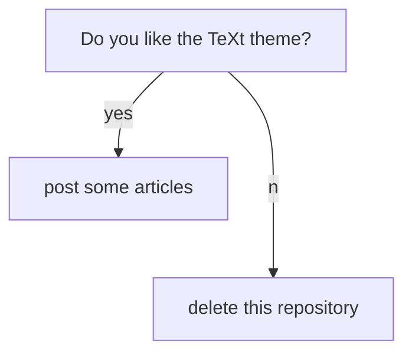
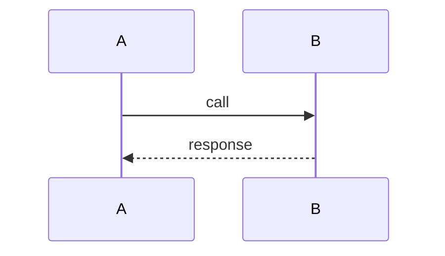
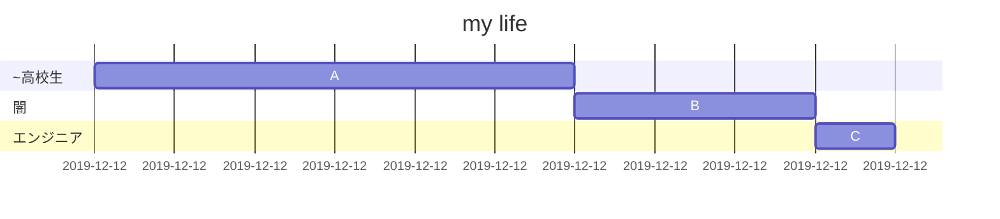

`TeXt` というテーマが便利そうだったので使ってみる。
この記事では `TeXt` に実装されているいろいろな機能をテストする。

## Markdown

| N        | 100'000 | 20'0000 | 400'000 | 800'000 | 1'600'000 | 3'200'000 | 6'400'000 |
| -------- | ------- | ------- | ------- | ------- | --------- | --------- | --------- |
| time[ms] | 2.4     | 5.0     | 9.9     | 64.0    | 208.0     | 416.0     | 803.0     |

---

* __A__
    * _B_
* C
    1. D
    ```cpp
    int E = 1
    ```
    1. ~Z~
* `Z`
* [google](https://www.google.co.jp/)
* [to last](#Haskell)

## Markdown Enhancements

### Mathjax

inline math: $$f(X^{n}_{i} - X^{n}_{i-1}) \cap X_{i} = \phi$$  
global math

$$X_{i}=F(X_{i-1})\cup X_{i-1}$$

### Mermaid

#### Flow Chart



#### Sequence Diagram



#### Gant Diagram



## Extra

* Icons: :ghost:  :ghost: :star2:
* Button: [BUTTON](#){:.button.button--primary.button--pill}

Success Text.
{:.success}

aaa

Info Text.
{:.info}

bbb

Warning Text.
{:.warning}

ccc

Error Text.
{:.error}

## Source Code

### C++

```cpp
constexpr int N = 100'000;
alignas(32) float ra[N], rb[N], rc[N], ia[N], ib[N], ic[N];
void simd_vector_mult() {
    for (auto t = 0; t < 100; ++t) {
        for (int i = 0; i < N; i += 8) {
            __m256 vra = _mm256_load_ps(&(ra[i]));
            __m256 via = _mm256_load_ps(&(ia[i]));
            __m256 vrb = _mm256_load_ps(&(rb[i]));
            __m256 vib = _mm256_load_ps(&(ib[i]));
            __m256 vrc = vra * vrb - via * vib;
            __m256 vic = vra * vib + via * vrb;
            _mm256_store_ps(&(rc[i]), vrc);
            _mm256_store_ps(&(ic[i]), vic);
        }
    }
}
```

### Assembly

```Assembly
	.globl	_Z16simd_vector_multv   # -- Begin function _Z16simd_vector_multv
	.p2align	4, 0x90
	.type	_Z16simd_vector_multv,@function
_Z16simd_vector_multv:                  # @_Z16simd_vector_multv
	.cfi_startproc
# %bb.0:
	xorl	%eax, %eax
	.p2align	4, 0x90
.LBB5_1:                                # =>This Loop Header: Depth=1
                                        #     Child Loop BB5_2 Depth 2
	xorl	%ecx, %ecx
	.p2align	4, 0x90
.LBB5_2:                                #   Parent Loop BB5_1 Depth=1
                                        # =>  This Inner Loop Header: Depth=2
	vmovaps	ra(,%rcx,4), %ymm0
	vmovaps	rb(,%rcx,4), %ymm2
	vmovaps	ia(,%rcx,4), %ymm1
	vmovaps	ib(,%rcx,4), %ymm3
	vmulps	%ymm2, %ymm0, %ymm4
	vmulps	%ymm3, %ymm1, %ymm5
	vmulps	%ymm3, %ymm0, %ymm0
	vmulps	%ymm2, %ymm1, %ymm1
	vsubps	%ymm5, %ymm4, %ymm4
	vaddps	%ymm0, %ymm1, %ymm0
	vmovaps	%ymm4, rc(,%rcx,4)
	vmovaps	%ymm0, ic(,%rcx,4)
	addq	$8, %rcx
	cmpq	$100000, %rcx           # imm = 0x186A0
	jb	.LBB5_2
# %bb.3:                                #   in Loop: Header=BB5_1 Depth=1
	incl	%eax
	cmpl	$100, %eax
	jne	.LBB5_1
# %bb.4:
	vzeroupper
	retq
.Lfunc_end5:
	.size	_Z16simd_vector_multv, .Lfunc_end5-_Z16simd_vector_multv
	.cfi_endproc
                                        # -- End function
```

### Rust

```rust
#[derive(Debug, Clone, Eq, PartialEq)]
pub enum ISBNError {
    LengthError,
    PrefixError,
    HyphensError,
    EmptyGroup,
    EmptyPublisher,
    EmptyTitle,
    EmptyCheckDigit,
    InvalidCheckDigit,
    InvalidChar,
}

fn num_digits(mut num: u32) -> u32 {
    let mut digits = 0;

    while num > 0 {
        num /= 10;
        digits += 1
    }

    digits
}

fn is_valid_check_digit(group: u32, publisher: u32, title: u32, check_digit: u32) -> bool {
    let publisher_digits = num_digits(publisher) as u64;
    let title_digits = num_digits(title) as u64;
    let mut full = group as u64 * exp(10, publisher_digits + title_digits)
        + publisher as u64 * exp(10, title_digits)
        + title as u64;

    let mut sum = 0;
    for x in 0..=8 {
        let tmp = full % 10;
        full /= 10;
        sum += tmp * (x + 2);
    }

    (11 - sum % 11) % 11 == check_digit as u64
}

pub fn isbn(string: &str) -> Result<(u32, u32, u32), ISBNError> {
    if !string.starts_with("ISBN") {
        return Err(ISBNError::PrefixError);
    }
    if string.len() != 17 {
        return Err(ISBNError::LengthError);
    }
    let hyphens = string.match_indices("-").count();
    if hyphens != 3usize {
        return Err(ISBNError::HyphensError);
    }

    let isbn10_pattern = Regex::new(r"ISBN(\d*)-(\d*)-(\d*)-(\d|X)").unwrap();
    let capture = isbn10_pattern.captures(string);
    if capture.is_none() {
        if string.ends_with('-') {
            return Err(ISBNError::EmptyCheckDigit);
        }
        return Err(ISBNError::InvalidChar);
    }
    let capture = capture.unwrap();

    let group = match capture.get(1).unwrap().as_str().parse::<u32>() {
        Ok(val) => val,
        Err(_) => return Err(ISBNError::EmptyGroup),
    };
    let publisher = match capture.get(2).unwrap().as_str().parse::<u32>() {
        Ok(val) => val,
        Err(_) => return Err(ISBNError::EmptyPublisher),
    };
    let title = match capture.get(3).unwrap().as_str().parse::<u32>() {
        Ok(val) => val,
        Err(_) => return Err(ISBNError::EmptyTitle),
    };
    let check_digit = match capture.get(4).unwrap().as_str().parse::<u32>() {
        Ok(val) => val,
        Err(_) => 10u32,
    };

    if is_valid_check_digit(group, publisher, title, check_digit) {
        Ok((group, publisher, title))
    } else {
        Err(ISBNError::InvalidCheckDigit)
    }
}
```

### Haskell

```haskell
module Main where
import           Data.Char

data Token = NUM Int                -- 数値
           | ADD | SUB | MUL | DIV  -- 演算子
           | LPAR | RPAR            -- カッコ
           | EOF
           | DUMMY
    deriving (Show, Eq)

data Expr = Number Int | Operator2 Token Expr Expr deriving (Show)

-- Tokenizer
-- TODO: エラー処理
tokenize :: String -> [Token]
tokenize "" = []
tokenize arr
  | x == ' '
  = tokenize $ tail arr
  | x == '+'
  = ADD : (tokenize $ tail arr)
  | x == '-'
  = SUB : (tokenize $ tail arr)
  | x == '*'
  = MUL : (tokenize $ tail arr)
  | x == '/'
  = DIV : (tokenize $ tail arr)
  | x == '('
  = LPAR : (tokenize $ tail arr)
  | x == ')'
  = RPAR : (tokenize $ tail arr)
  | isDigit x
  = let number = read $ takeWhile isDigit arr
        remain = dropWhile isDigit arr
    in  NUM number : (tokenize remain)
  | otherwise
  = []  -- TODO: errorの実装
  where x = head arr

-- Parser
-- TODO: エラー処理

-- https://www.sigbus.info/compilerbook より引用
-- expr    = mul ("+" mul | "-" mul)*
-- mul     = primary ("*" primary | "/" primary)*
-- primary = num | "(" expr ")"

head' :: [Token] -> Token
head' []      = DUMMY
head' (x : _) = x

exprImpl :: (Expr, [Token]) -> (Expr, [Token])
exprImpl (lhs, (op : tokens))
  | nextOp == ADD || nextOp == SUB = exprImpl (Operator2 op lhs rhs, remain)
  | otherwise                      = (Operator2 op lhs rhs, remain)
 where
  (rhs, remain) = mul tokens
  nextOp        = head' remain
exprImpl a = a -- for exhaustive pattern

expr :: [Token] -> (Expr, [Token])
expr tokens | x == ADD || x == SUB = exprImpl (lhs, remain)
            | otherwise            = (lhs, remain)
 where
  (lhs, remain) = mul tokens
  x             = head' remain

mulImpl :: (Expr, [Token]) -> (Expr, [Token])
mulImpl (lhs, (op : tokens))
  | nextOp == MUL || nextOp == DIV = mulImpl (Operator2 op lhs rhs, remain)
  | otherwise                      = (Operator2 op lhs rhs, remain)
 where
  (rhs, remain) = primary tokens
  nextOp        = head' remain
mulImpl a = a -- for exhaustive pattern

mul :: [Token] -> (Expr, [Token])
mul tokens | x == MUL || x == DIV = mulImpl (lhs, remain)
           | otherwise            = (lhs, remain)
 where
  (lhs, remain) = primary tokens
  x             = head' remain

primary :: [Token] -> (Expr, [Token])
primary (LPAR : tokens) =
  let (e, remain) = expr tokens -- TODO: head remain == RPARのチェック
  in  (e, tail remain)
primary (NUM x : tokens) = (Number x, tokens)
primary a                = (Number 0, a) -- for exhaustive pattern

-- evaluator
eval :: Expr -> Int
eval (Number x) = x
eval (Operator2 op lhs rhs) | op == ADD = eval lhs + eval rhs
                            | op == SUB = eval lhs - eval rhs
                            | op == MUL = eval lhs * eval rhs
                            | op == DIV = eval lhs `div` eval rhs
eval _ = 0 -- for exhaustive pattern

main :: IO()
main = do
    line <- getLine
    let tokens = tokenize line
    let (parsed,_) = expr tokens
    print tokens
    print parsed
    print $ eval parsed
```